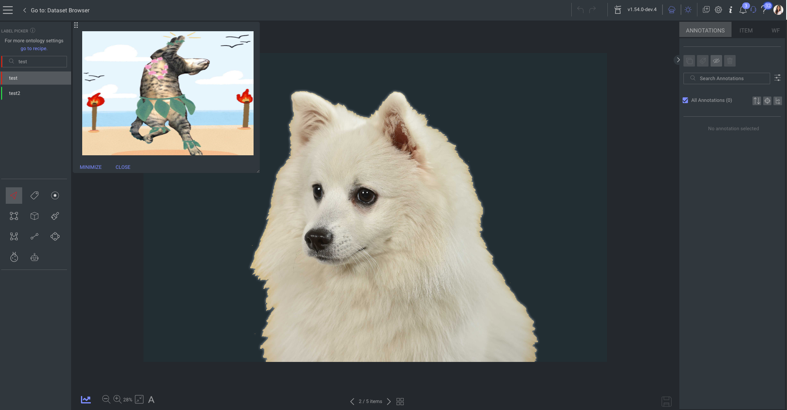

# Reference Viewer

  

---

  

---
## Description

The Reference Viewer application enables annotators to view other items in a draggable, resizable window (A.K.A Floating Window) while annotating in the studio.

## Supported mimetypes
* `image/*`
* `video/*`
* `application/pdf`


## Application Usage in the Dataloop Platform
To use the Reference Viewer in an item, add a modality of type "preview" as follows:
``` json
"modalities": [{
    "ref": "63b42ec7f0d95bdf257c5f8f",
    "type": "preview",
    "mimetype": "image/png",
    "stream": "https://gate.dataloop.ai/api/v1/items/63b42ec7f0d95bdf257c5f8f/stream"
}]
```
Using the SDK:

```python
import dtlpy as dl
item = dl.items.get(item_id='649ffd811f3cf9143d36eb18')
item.modalities.create(modality_type='preview',  
                       name='reference-viewer',
                       mimetype= "image/png",
                       ref= "649ffd7b80327f84538f6d8c")
```
For more information, checkout out the [Dataloop Documentation](https://docs.dataloop.ai/docs/modality)!
## Contributions, Bugs and Issues - How to Contribute  
We welcome anyone to help us improve this app.  
[Here's](CONTRIBUTING.md) a detailed instructions to help you open a bug or ask for a feature request
